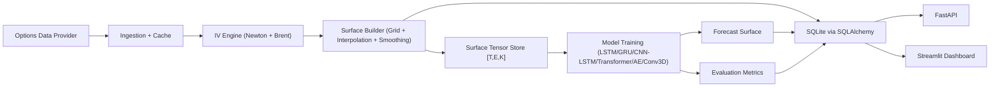

<div align="center">

# Neural Volatility Surface Forecaster


</div>

An institutional-style quantitative research platform to model and forecast the **implied volatility (IV) surface** across strike and expiry dimensions using deep learning.

---

## 🚀 About The Project

This project treats volatility as a **surface evolution problem**, not a single-point prediction problem.

Given historical IV surfaces:
- Input: past `N` surfaces `[time, expiry, strike]`
- Output: future surface `[expiry, strike]`

The system is designed for:
- Volatility smile/skew dynamics
- Term structure shifts
- Regime transitions
- Forecast-vs-market visualization

---

## ✨ Key Features

- 📥 **Market Data Ingestion**: Pulls options chain snapshots (free default: Yahoo Finance).
- 🧮 **Pricing & IV Engine**: Black-Scholes pricing, Greeks, and robust IV inversion (Newton + Brent fallback).
- 🗺️ **Surface Construction**: Strike/expiry grids, interpolation, smoothing, and tensor storage.
- 🧠 **Neural Forecasting**: LSTM, GRU, CNN-LSTM, Transformer, Autoencoder, Conv3D.
- 📊 **Evaluation Stack**: RMSE, MAE, directional skew accuracy, cosine surface similarity.
- 🧪 **Research Utilities**: Regime tagging, feature engineering, notebooks.
- ⚡ **Serving Layer**: FastAPI endpoints + Streamlit dashboard.
- 🗄️ **Persistence**: SQLAlchemy + SQLite for raw chains, surfaces, forecasts, and metrics.


---

## 🛠️ Tech Stack

### Quant & Data
- `numpy`, `pandas`, `scipy`, `statsmodels`
- `py_vollib`, `QuantLib`
- `yfinance` (default free provider)

### ML
- `PyTorch`
- `scikit-learn`
- Optional tracking: `MLflow`

### App Layer
- `FastAPI` + `Pydantic`
- `Streamlit`
- `Plotly`, `Matplotlib`, `Seaborn`
- `SQLAlchemy`

---

## 🧠 Core Quant Concepts (Quick Glossary)

- **Implied Volatility (IV)**: Volatility implied by market option prices under Black-Scholes.
- **Smile / Skew**: Cross-strike IV shape and directional slope.
- **Term Structure**: How IV changes across maturities.
- **Moneyness**: Relative strike/spot relationship (`K/S` or `log(K/S)`).
- **Risk-Neutral Pricing**: Pricing under a measure where discounted prices are martingales.
- **Greeks**: Sensitivities (`delta`, `gamma`, `theta`, `vega`, `rho`).

---

## 📂 Project Structure

```bash
Neural-Volatility-Surface-Forecaster/
├── data/
│   ├── raw/
│   ├── processed/
│   └── cached/
├── notebooks/
├── configs/
├── src/
│   ├── ingestion/
│   ├── pricing/
│   ├── iv_surface/
│   ├── preprocessing/
│   ├── features/
│   ├── datasets/
│   ├── models/
│   ├── training/
│   ├── evaluation/
│   ├── visualization/
│   ├── api/
│   ├── database/
│   └── utils/
├── dashboard/
├── tests/
├── docker/
├── requirements.txt
├── main.py
└── README.md
```

---

## 🏗️ Architecture



---

## 📊 Streamlit Dashboard (What Each Page Shows)

### 1) Live options chain
- Latest contract rows (strike, bid/ask, volume, OI, IV, Greeks).
- Quick market snapshot (contracts count + median IV).

### 2) Current IV surface
- Interactive 3D surface and 2D heatmap.
- View smile/skew/term-structure shape in one place.

### 3) Historical surface playback
- Animated IV surface evolution over time.
- Great for spotting shock regimes and deformation patterns.

### 4) Forecasted surface
- Latest predicted surface from trained model.
- Term-structure slice compare: predicted vs actual.

### 5) Model performance
- Stored run metrics over time.
- RMSE/MAE trend chart for tracking model quality.

### 6) Regime analysis
- Surface feature panel (level/skew/curvature/slope/shock proxy).
- Cluster-based regime labels and distribution.

---

## ⚙️ Local Setup

### 1) Clone and enter
```bash
git clone https://github.com/aryannverse/Neural-Volatility-Surface-Forecaster.git
cd Neural-Volatility-Surface-Forecaster
```

### 2) Environment + install
```bash
python3.11 -m venv .venv
source .venv/bin/activate
pip install -r requirements.txt
```

### 3) Initialize
```bash
python main.py
```

### 4) Pull surface data
```bash
python main.py ingest --ticker SPY
python main.py ingest --ticker SPY --backfill-days 40 --frequency 1D
```

### 5) Train
```bash
python main.py train --ticker SPY --model transformer --lookback 20 --horizon 1 --epochs 30 --batch-size 32
```

### 6) Run services (separate terminals)
```bash
python main.py api
python main.py dashboard
```

---

## 🔌 API Endpoints

- `GET /surface/current/{ticker}`
- `GET /surface/history/{ticker}`
- `GET /forecast/{ticker}`
- `POST /train`
- `WS /ws/forecast/{ticker}`

Swagger:
`http://localhost:8000/docs`

---

## 💸 Data Providers

- Yahoo Finance (`yfinance`)

### Optional integrations
- Polygon
- Alpaca

---

## ✅ Testing

```bash
PYTHONPATH=. pytest -q
```

---


## 🔭 Future Extensions

- Arbitrage-constrained training losses
- Uncertainty-aware forecasts
- Regime-conditioned model ensembles
- Cross-asset transfer learning
- Volatility strategy overlays

---

<div align="center">
Built with focus, curiosity, and quant obsession by <a href="https://github.com/aryannverse">aryannverse</a> ⚡
</div>
